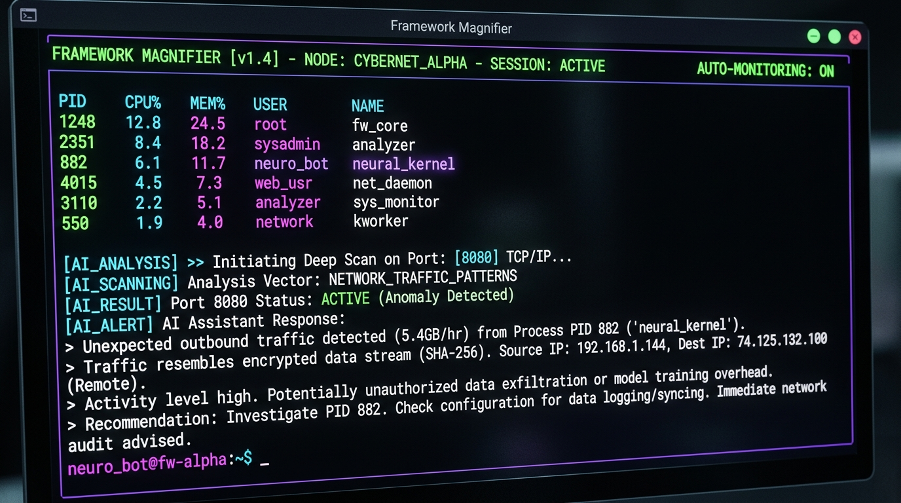

# Framework Magnifier



An AI-powered, cross-platform terminal system monitor. It acts as a lightweight process and port viewer with built-in AI diagnostics powered by Google Gemini / Gemma.

It provides human-readable explanations of running processes, ownership of network ports, and instant troubleshooting of failing commands and missing dependencies.

## Features

- **Cross-Platform:** Works seamlessly on Windows, macOS, and Linux.
- **Process & Port Monitoring:** View top processes by CPU or memory, and check active network ports.
- **AI Diagnostics:** Ask the AI to explain what a specific process does or why an application is listening on a specific port.
- **Error Explainer:** Run commands through `magnifier.py`. If they fail, the AI will explain the root cause and provide numbered steps to fix it.
- **Piped Log Analysis:** Pipe any `stderr` log directly to the AI for troubleshooting.
- **Multi-Language Dependency Checker:** Use `check-deps` to scan your project's `requirements.txt`, `package.json`, `Cargo.toml`, `go.mod`, `pom.xml`, and more. It queries the local package manager (pip, npm, cargo, go, maven, etc.) and uses AI to identify missing dependencies or version conflicts!

## Installation

1. Clone this repository:
   ```bash
   git clone <your-repo-url>
   cd framework-magnifier
   ```

2. Install the required Python dependencies:
   ```bash
   pip install -r requirements.txt
   ```

3. Export your Google Generative AI API key (get one from Google AI Studio). You can copy `.env.example` to `.env` or export directly:
   ```bash
   # On macOS / Linux
   export GEMINI_API_KEY="your_api_key_here"

   # On Windows (PowerShell)
   $env:GEMINI_API_KEY="your_api_key_here"
   ```

*(Optional)* You can also specify the exact model name. By default it uses `gemma-4`:
```bash
export MAGNIFIER_MODEL="gemma-4"
```

## Usage

```bash
# List top 10 processes by CPU
python magnifier.py

# List top 10 processes by Memory
python magnifier.py --mem

# List all listening ports and the apps using them
python magnifier.py --ports

# AI Analysis: What is this process? Is it safe?
python magnifier.py <PID>

# AI Analysis: What app is on this port and why?
python magnifier.py port 8080

# Error Diagnosis: Run a command. If it fails, AI explains why.
python magnifier.py run -- npm install

# Error Diagnosis: Pipe error logs directly to AI
cargo build 2>&1 | python magnifier.py --errors

# Dependency Diagnosis: Check for missing/conflicting dependencies across all languages
python magnifier.py check-deps
```

## Supported Dependency Managers
The `check-deps` command automatically detects and supports:
- Python (`requirements.txt` -> `pip`)
- Node.js (`package.json` -> `npm`)
- Rust (`Cargo.toml` -> `cargo`)
- Ruby (`Gemfile` -> `bundle`)
- Go (`go.mod` -> `go`)
- PHP (`composer.json` -> `composer`)
- Java / Maven (`pom.xml` -> `mvn`)
- Java / Gradle (`build.gradle` -> `gradle`)

## Testing
Run the test suite using `unittest`:
```bash
python -m unittest discover tests/
```
